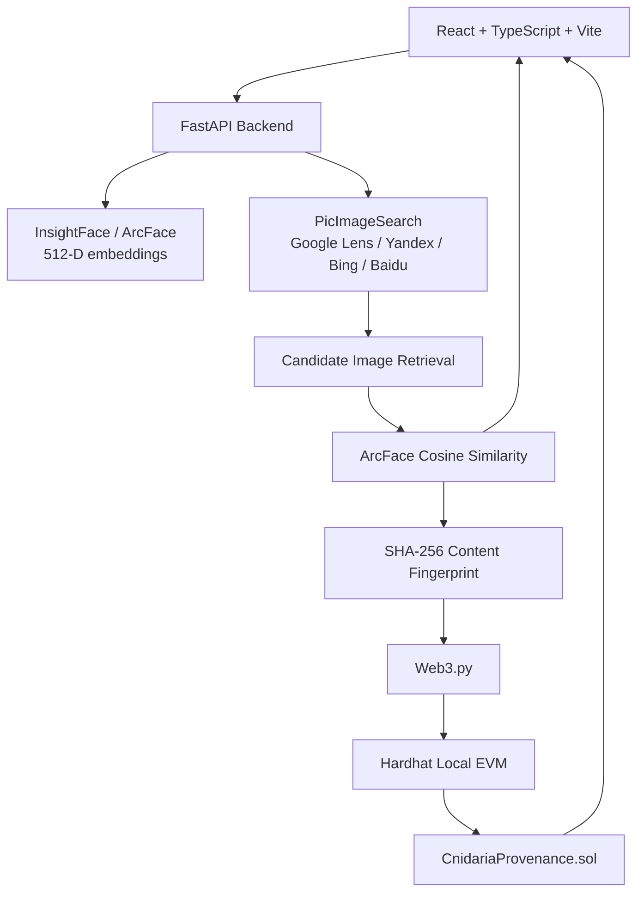

<p align="center">
  
</p>

<h1 align="center">Cnidaria</h1>

<p align="center"><strong>Trace visual appearances. Verify digital provenance.</strong></p>

<p align="center">
  
  
  
  
  
</p>

Cnidaria is a visual attribution and content-provenance prototype that helps trace where an image of a person appears online and verify whether discovered media matches a previously registered content fingerprint.

It combines **InsightFace face detection**, **512-dimensional ArcFace embeddings**, **reverse-image discovery**, **cosine-similarity ranking**, **SHA-256 content fingerprinting**, and an **EVM-compatible smart contract** into one auditable workflow.

```text
Upload image → Detect face → Search the web → Rank visual matches → Fingerprint content → Verify provenance
```

> **Cnidaria does not prove a person's identity.** Face similarity is used only to rank visual matches, while blockchain verification checks exact content fingerprints.

---

## Why Cnidaria?

Images are copied, reposted, edited, and redistributed across the internet with very little context about where they came from or whether the exact content has changed.

Traditional reverse-image search can help discover related media, but it does not by itself provide a unified workflow for:

- face-specific visual similarity ranking,
- exact-byte cryptographic fingerprinting,
- provenance registration,
- tamper verification, and
- an exportable audit trail.

Cnidaria brings those stages together in a single investigation pipeline.

---

## What It Does

1. **Accepts a reference image** through the React interface.
2. **Detects a single face** with InsightFace and extracts a 512-D ArcFace embedding.
3. **Queries reverse-image providers** through PicImageSearch.
4. **Downloads candidate images** and extracts comparable face embeddings.
5. **Ranks candidates** using ArcFace cosine similarity.
6. **Calculates SHA-256 fingerprints** from the exact candidate image bytes.
7. **Registers and verifies fingerprints** through an EVM-compatible Solidity contract.
8. **Demonstrates tamper detection** by comparing a modified fingerprint against the registered record.
9. **Presents an investigation view and report** containing visual-match and provenance information.

---

## Demo Flow

A typical end-to-end demonstration looks like this:

```text
Reference image
      │
      ▼
Face detection + ArcFace embedding
      │
      ▼
Reverse-image discovery
      │
      ▼
Candidate retrieval + deduplication
      │
      ▼
ArcFace similarity ranking
      │
      ▼
Inspect source and candidate metadata
      │
      ▼
SHA-256 fingerprint
      │
      ▼
EVM provenance registration / verification
      │
      ▼
Audit result + report
```

---

## System Architecture



### Core separation of concerns

- **Computer vision** answers: *How visually similar are these detected faces?*
- **Reverse-image discovery** answers: *Where might related images appear online?*
- **SHA-256** answers: *Are these exact file bytes identical?*
- **The provenance contract** answers: *Was this exact fingerprint registered, when, and by which wallet address?*

---

## Technology Stack

| Layer | Technology |
|---|---|
| Frontend | React 19, TypeScript, Vite |
| UI / Motion | Tailwind CSS tooling, Motion, Lucide React |
| Backend API | Python, FastAPI |
| Image Processing | OpenCV, Pillow |
| Face Detection / Embeddings | InsightFace, ArcFace (`buffalo_l`) |
| Model Runtime | ONNX Runtime |
| Reverse-Image Discovery | PicImageSearch: Google Lens, Yandex, Bing, Baidu |
| Candidate Networking | HTTPX |
| Similarity Metric | Cosine similarity |
| Content Fingerprinting | SHA-256 |
| Blockchain Integration | Web3.py |
| Smart Contract | Solidity |
| Development EVM | Hardhat local network |
| Reports | jsPDF |

---

## Quick Start

### Prerequisites

- Node.js and npm
- Python with compatible InsightFace / ONNX Runtime packages for your platform
- Git

### 1. Clone the repository

```bash
git clone https://github.com/manasvignesh/Cnidaria.git
cd Cnidaria
```

### 2. Install frontend dependencies

```bash
npm install
```

### 3. Set up the FastAPI backend

```bash
cd backend
python -m venv .venv
```

Activate the virtual environment:

**Windows**

```powershell
.venv\Scripts\activate
```

**macOS / Linux**

```bash
source .venv/bin/activate
```

Install backend dependencies:

```bash
pip install -r requirements.txt
```

### 4. Install and start the local blockchain

The Hardhat project lives in `backend/blockchain` — not in the repository root.

```bash
cd backend/blockchain
npm install
npm run node
```

Keep that terminal running. It exposes the local JSON-RPC endpoint at:

```text
http://127.0.0.1:8545
```

### 5. Deploy the provenance smart contract

Open another terminal:

```bash
cd backend/blockchain
npm run deploy
```

The development deployment normally uses Hardhat's deterministic local accounts and writes the deployed contract information used by the backend.

### 6. Start the FastAPI backend

Open another terminal from the repository root:

```bash
cd backend
```

Activate the virtual environment again, then run:

```bash
python -m uvicorn app.main:app --host 127.0.0.1 --port 8000
```

Backend API:

```text
http://127.0.0.1:8000
```

Health check:

```text
GET http://127.0.0.1:8000/api/health
```

### 7. Configure the frontend for live API mode

Create or update the root `.env` file:

```env
VITE_API_URL=http://127.0.0.1:8000
```

### 8. Launch the frontend

From the repository root:

```bash
npm run dev
```

Open:

```text
http://localhost:3000
```

---

## Live Mode vs Demo Mode

| Mode | Configuration | Behavior |
|---|---|---|
| **Live API Mode** | `VITE_API_URL=http://127.0.0.1:8000` | Uses the FastAPI computer-vision, reverse-search, matching, hashing, and blockchain pipeline |
| **Offline / Demo Mode** | `VITE_API_URL` omitted | Uses `src/services/mockApi.ts` to demonstrate the interface without the live backend |

> **Important:** parts of the frontend currently fall back to mock responses when a live API request fails. Mock results are intended for interface demonstration only and must not be treated as live attribution or provenance evidence.

For technical evaluation, keep the FastAPI and Hardhat processes running and verify the backend responses/logs while demonstrating the live pipeline.

---

## API Endpoints

| Method | Endpoint | Purpose |
|---|---|---|
| `GET` | `/api/health` | Backend and dependency health status |
| `POST` | `/api/scan` | Face detection and 512-D ArcFace embedding generation |
| `POST` | `/api/search` | Reverse-image discovery and ArcFace candidate ranking |
| `POST` | `/api/blockchain/register` | Register a SHA-256 fingerprint on the local EVM contract |
| `POST` | `/api/blockchain/verify` | Check whether a SHA-256 fingerprint is registered |
| `POST` | `/api/verify` | Frontend compatibility route for the verification sequence |

---

## Project Structure

```text
Cnidaria/
├── src/                         # React frontend
│   ├── components/              # Upload, scan, results, provenance and audit UI
│   ├── hooks/                   # Pipeline orchestration
│   ├── services/                # Live API, mock API and PDF report logic
│   └── types/                   # Frontend pipeline types
├── public/                      # Static assets and project banner
├── backend/
│   ├── app/
│   │   ├── api/endpoints/       # FastAPI routes
│   │   ├── core/                # Face, search, matching, hashing and blockchain logic
│   │   └── schemas/             # Pydantic request/response models
│   ├── blockchain/
│   │   ├── contracts/           # CnidariaProvenance.sol
│   │   ├── scripts/             # Hardhat deployment scripts
│   │   └── hardhat.config.js
│   ├── tests/
│   └── requirements.txt
├── package.json
└── README.md
```

---

## Provenance Model

Cnidaria stores a **SHA-256 digest**, not the original image, in the provenance smart contract.

For each registered fingerprint, the contract records:

- whether the fingerprint exists,
- the block timestamp of first registration, and
- the wallet address that registered it.

This means the blockchain component can show that an exact fingerprint was registered at a particular time by a particular address.

It **does not independently prove**:

- who created the image,
- who owns the copyright,
- whether the image is truthful,
- whether the person shown is a particular real-world identity, or
- whether a registrant had authority to register that content.

---

## Responsible Use & Limitations

### Face similarity is not identity proof

ArcFace similarity scores represent feature similarity between detected faces. They should not be presented as definitive identity verification.

### Exact hashes are intentionally sensitive to any byte change

SHA-256 verification is exact. Re-encoding, resizing, metadata changes, compression, cropping, or editing can produce a different fingerprint even when an image appears visually similar.

### Reverse-image providers are external dependencies

Search quality and availability depend on third-party providers. Results can vary, providers can rate-limit requests, and integrations can break when external services change.

### The current blockchain is a local development network

Hardhat is used for reproducible local demonstration. It is not a public Ethereum deployment and should not be described as one.

### Biometric-style data requires careful handling

Face embeddings remain in backend memory in the current prototype, but any production deployment should add explicit consent, retention limits, access controls, secure storage policies, and jurisdiction-appropriate privacy safeguards.

### Not for high-stakes identification

Cnidaria is a research / demonstration prototype and should not be used as the sole basis for law-enforcement, employment, financial, access-control, or other high-impact decisions about a person.

---

## Build Verification

Frontend type-check:

```bash
npm run lint
```

Production build:

```bash
npm run build
```

---

## Future Work

Potential next steps include:

- explicit live-mode failure states instead of automatic mock fallback,
- persistent, authenticated investigation sessions,
- public testnet deployment for provenance demonstrations,
- creator / organization identity binding for registrations,
- perceptual hashing alongside SHA-256 for transformed-media comparison,
- richer source timelines and duplicate clustering,
- C2PA interoperability,
- stronger privacy controls for facial embeddings,
- provider-independent reverse-image search adapters, and
- benchmark datasets for measuring retrieval quality and similarity thresholds.

---

## What Cnidaria Is — and Is Not

**Cnidaria is:**

- a visual-attribution research prototype,
- a reverse-image candidate discovery workflow,
- an ArcFace-based visual similarity ranker,
- a cryptographic content-fingerprint verifier, and
- an EVM provenance demonstration.

**Cnidaria is not:**

- a legal identity-verification system,
- a copyright ownership oracle,
- a guarantee that web-search results are complete,
- a public-mainnet blockchain product, or
- a substitute for human review in high-stakes investigations.
